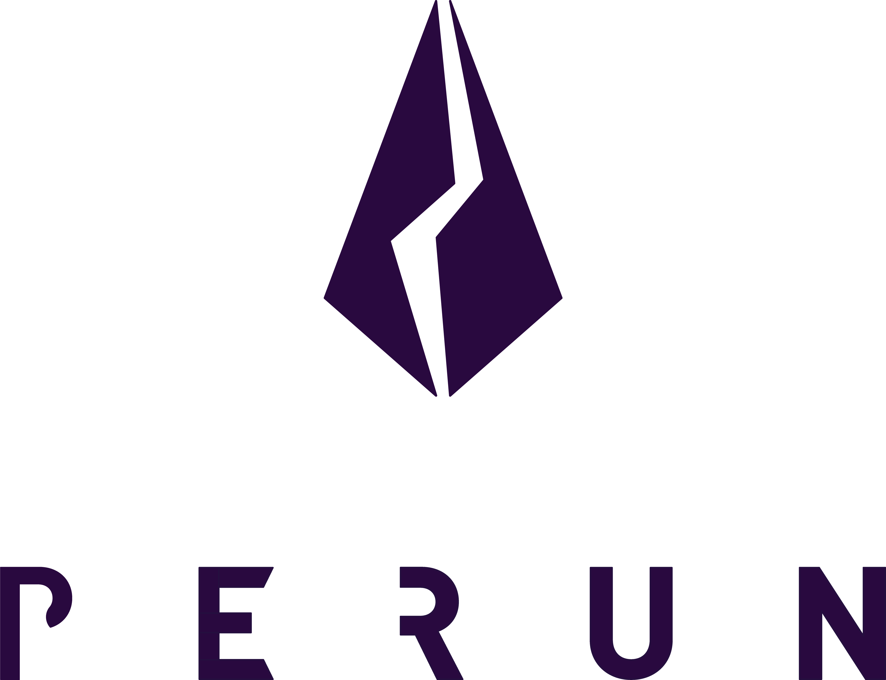

<h1 align="center"><br>
    <a href="https://perun.network/"></a>
<br></h1>

<h2 align="center">Perun CKB Contracts </h2>

<p align="center">
  <a href="https://www.apache.org/licenses/LICENSE-2.0.txt"></a>
  <a href="https://github.com/perun-network/perun-ckb-contract/actions/workflows/rust.yml"></a>
</p>

# [Perun](https://perun.network/) CKB contracts

This repository contains the smart contracts that implement **Perun payment channels on Nervos CKB**, enabling secure and efficient off-chain transactions backed by CKB’s UTXO architecture.

The design follows the same encoding and verification semantics used in the [**Perun Ethereum contract**](https://github.com/hyperledger-labs/perun-eth-contracts).  
By applying an **Ethereum-style binary encoding format** for channel identification, and signed updates, the CKB implementation can validate the *same* off-chain messages recognized by Ethereum. This ensures:

- a compatible state representation across chains
- cross-chain verifiability of signed updates
- interoperability with Ethereum-based Perun backends
- support for multi-chain Perun channels and swaps

This shared data model allows Perun channels on CKB combined with Perun channels on Ethereum.

## Scripts Overview
### **1. `perun-channel-lockscript`**
Controls access rights to the *live* Perun channel cell.  
Only channel participants can consume or update the channel.

### **2. `perun-channel-typescript`**
Implements the on-chain state machine for Perun channels.  
It validates channel state transitions and enforces correct dispute handling.  
Functionally similar to a stateful NFT script with Perun-specific logic.

### **3. `perun-funds-lockscript`**
Manages the channel’s locked assets (CKB or SUDT).  
Ensures that only the channel’s participants can withdraw or move funds.

## Prerequisites
Update the rustc version to 1.85.0 and install the following:
```
sudo apt install gcc-riscv64-unknown-elf binutils-riscv64-unknown-elf \
libc6-dev-riscv64-cross libc6-riscv64-cross linux-libc-dev-riscv64-cross
```
```
wget https://apt.llvm.org/llvm.sh && chmod +x llvm.sh && sudo ./llvm.sh 18 && rm llvm.sh
```
```
cargo install cargo-generate
```
Add the target:
```
rustup target add riscv64imac-unknown-none-elf
```

## Build and Test
Build contracts:

``` sh
chmod +x ./setup_env.sh
```

``` sh
make prepare
```

``` sh
source ./setup_env.sh build && make build
```

Run tests:

``` sh
source ./setup_env.sh test && make test
```
or run them using the IDE

Notes:
- `setup_env.sh` uses target-scoped build variables for the RISC-V target to avoid contaminating host (x86_64) test builds.
- You can still run build and test in one shell, but switching modes (`build` -> `test`) is the recommended flow.

## LP Deployment And Migration

LP deployment manifests are provided separately for dev and release:

- `deployment/dev/deployment_lp.toml`
- `deployment/release/deployment_lp.toml`

Run a quick manifest/tooling check:

``` sh
make verify-lp-deployment
```

Prepare a fresh-deposit LP cell migration spec:

``` sh
bash scripts/lp_migration_prepare.sh \
  --pool-id 0x<64hex> \
  --owner-lock-hash 0x<64hex> \
  --operator-lock-hash 0x<64hex> \
  --policy-flags 0 \
  --policy-version 1 \
  --network dev \
  --out migrations_lp/lp_cell_spec.json \
  --monitoring-checklist-out migrations_lp/lp_monitoring_checklist.md
```

The helper prints a minimal command skeleton for deployment and LP cell bootstrap transactions.
It also writes a rollout checklist that you can use during staged rollout to track signer-auth failures,
policy violations, reserve conservation errors, and fee attribution drift.

Recommended staged rollout sequence:

1. Run `make verify-lp-deployment`.
2. Generate migration spec and checklist with `scripts/lp_migration_prepare.sh`.
3. Deploy LP scripts using `deployment/<network>/deployment_lp.toml`.
4. Execute one canary LP funding tx and one canary settlement tx.
5. Gate wider rollout on checklist pass with no unexplained signer/policy/conservation failures.

## perun-common
Additionally, to the available contracts we extracted common functionality into
its own `perun-common` crate which gives some additional helpers and
convenience functions when interacting with types used in Perun contracts.

## Problems
### 1. Missing file gnu/stubs-lp64.h
A common issue when compiling for RISC-V is the missing file: `gnu/stubs-lp64.h`

If the necessary packages are already installed, the file `/usr/riscv64-linux-gnu/include/gnu/stubs-lp64d.h`
should exist instead. This is due to the toolchain using the lp64d ABI (which includes double-precision floating point support) rather than plain lp64.

To resolve this, simply create a symbolic link:
```
sudo ln -s /usr/riscv64-linux-gnu/include/gnu/stubs-lp64d.h /usr/riscv64-linux-gnu/include/gnu/stubs-lp64.h
```

Then try compiling again.
